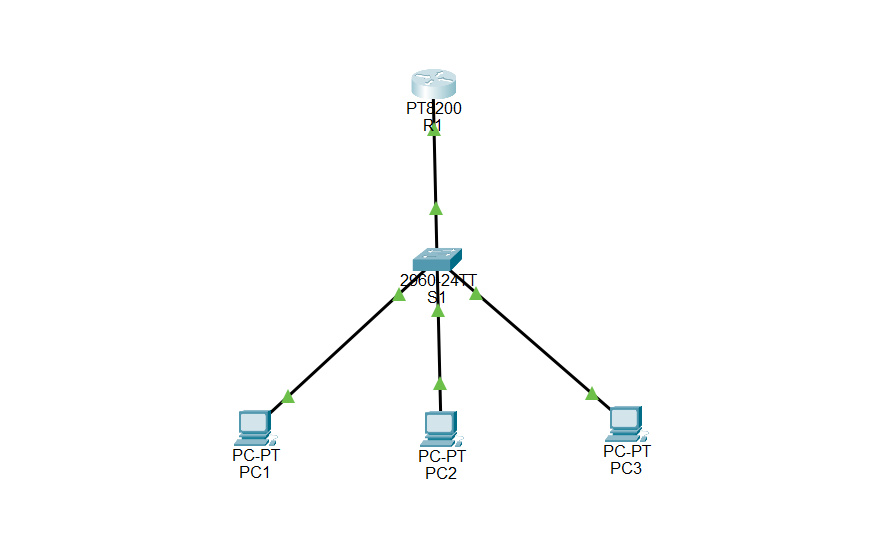
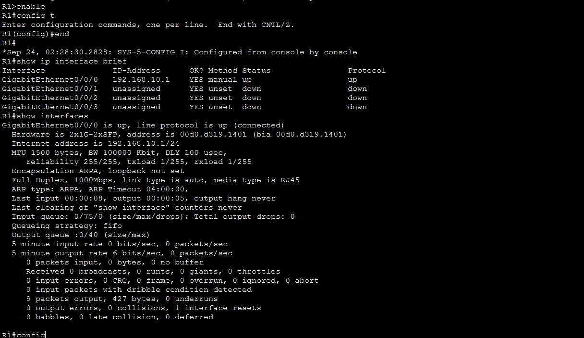
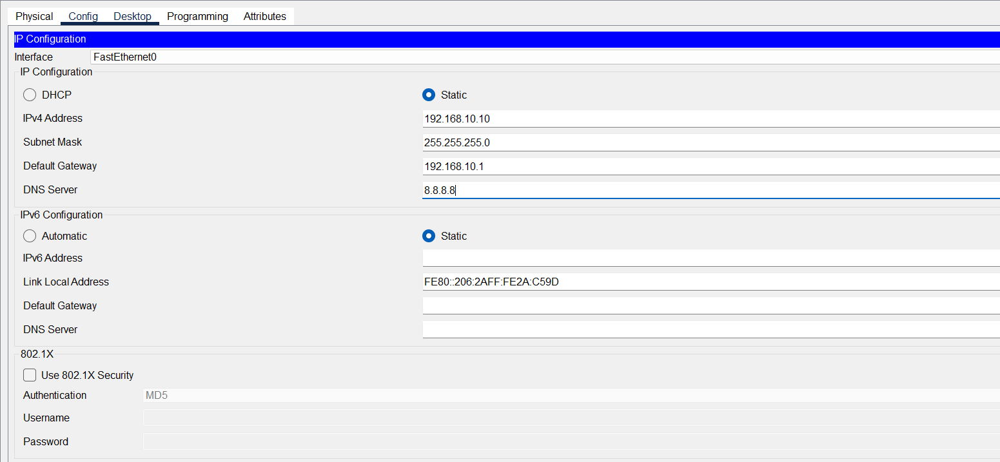
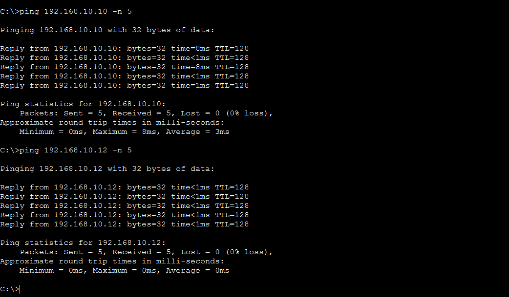
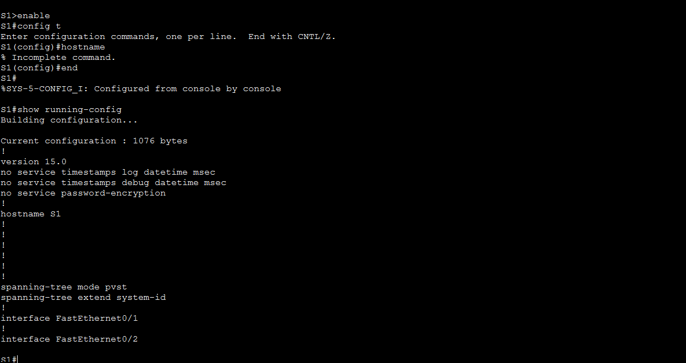

# 🏢 Small Office LAN | CCNA 1 Packet Tracer Project

<p align="center">
  
  
  
  
  
</p>

## Introduction

This project models a small office Local Area Network in Cisco Packet Tracer. The lab focuses on the practical foundations required to connect end devices through a switch and router, assign IPv4 addresses, configure a default gateway, and verify communication.

The project was built as a hands-on networking exercise rather than a theoretical topology. Each device was configured, connectivity was tested, and the final configuration was saved for repeatability.

## Objectives

- Build a small office LAN using Cisco Packet Tracer.
- Connect three PCs through a switch and router.
- Configure IPv4 addressing and default gateways.
- Configure the router interface used by the LAN.
- Verify Layer 3 connectivity between hosts and the gateway.
- Practice basic Cisco IOS verification commands.
- Troubleshoot addressing or interface problems using a structured process.
- Save the working device configuration.

## Environment / Architecture

### Topology

The lab contains:

- 1 Cisco router
- 1 Cisco switch
- 3 PCs
- 1 IPv4 LAN

### Addressing Plan

| Device | Interface | IPv4 Address | Subnet Mask | Default Gateway |
|---|---|---|---|---|
| R1 | G0/0 | 192.168.10.1 | 255.255.255.0 | N/A |
| PC1 | NIC | 192.168.10.10 | 255.255.255.0 | 192.168.10.1 |
| PC2 | NIC | 192.168.10.11 | 255.255.255.0 | 192.168.10.1 |
| PC3 | NIC | 192.168.10.12 | 255.255.255.0 | 192.168.10.1 |

The router interface acts as the default gateway for the three hosts.

## Tools & Technologies

- Cisco Packet Tracer
- Cisco IOS
- IPv4
- Ethernet switching
- Router interface configuration
- ICMP / ping
- Basic network troubleshooting

## Implementation Steps

### 1. Build the Physical Topology

The router, switch, and three PCs were placed in Packet Tracer and connected using appropriate Ethernet links.

The topology was kept intentionally small so that addressing, device configuration, and connectivity could be verified individually.




### 2. Configure the Router Interface

The LAN-facing router interface was configured with:

`192.168.10.1/24`

The interface was then enabled and verified.

Example verification:

```text
show ip interface brief
```

The objective was to confirm that the expected interface was present and operational before testing end-to-end communication.




### 3. Configure PC IPv4 Addresses

Each PC received a unique address from the `192.168.10.0/24` network:

- PC1: `192.168.10.10`
- PC2: `192.168.10.11`
- PC3: `192.168.10.12`

The default gateway for each host was set to `192.168.10.1`.




### 4. Verify Local Connectivity

Connectivity was tested from the PCs to the router gateway.

Example:

```text
ping 192.168.10.1
```

A successful response confirms that the host can reach the configured gateway across the LAN.




### 5. Verify Host-to-Host Connectivity

The PCs were also tested against one another to confirm that the addressing and switching environment supported communication between hosts on the same subnet.

### 6. Inspect the Router Configuration

The router interface state and addressing were checked using Cisco IOS verification commands.

```text
show ip interface brief
```

This provides a quick view of interface status and assigned IP addresses.


### 7. Save the Configuration

The working configuration was saved so that the device configuration could be preserved.

```text
copy running-config startup-config
```




## Configuration / Technical Details

The network uses a /24 IPv4 subnet:

- Network: `192.168.10.0/24`
- Router / gateway: `192.168.10.1`
- Host range used: `192.168.10.10` to `192.168.10.12`
- Broadcast: `192.168.10.255`

The design keeps all hosts within the same broadcast domain and uses the router interface as the default gateway.

## Screenshots & Evidence

Screenshots will be added to the `assets/` directory after the project evidence is uploaded.

| Evidence | Planned File |
|---|---|
| Final Packet Tracer topology | `assets/01-topology.png` |
| Router interface configuration | `assets/02-router-interface.png` |
| PC IPv4 addressing | `assets/03-ip-addressing.png` |
| Switch configuration | `assets/04-switch-configuration.png` |
| Connectivity verification | `assets/05-connectivity-test.png` |

## Challenges

- Keeping the IP addressing plan consistent across all hosts.
- Ensuring the router interface was configured with the correct gateway address.
- Distinguishing addressing problems from interface or connectivity problems.
- Verifying each layer of the topology before moving to end-to-end testing.

## Lessons Learned

This lab reinforced that basic networking problems are often easiest to solve systematically. Addressing, interface status, gateway configuration, and connectivity should be checked in a logical order rather than changing several settings at once.

It also strengthened practical familiarity with Cisco IOS verification commands and the relationship between host addressing, subnetting, switching, and the default gateway.

## Skills Demonstrated

- IPv4 addressing
- Subnetting fundamentals
- Router interface configuration
- Basic switch networking
- Cisco IOS verification
- ICMP connectivity testing
- Network troubleshooting
- Configuration persistence
- Packet Tracer topology design

## Conclusion

The Small Office LAN provides a practical foundation for understanding how hosts, switches, and routers work together in an IPv4 network. The project also establishes the troubleshooting workflow used in the more advanced routed-network and security labs in this portfolio.

## Project Status

**Completed**

## Author

**Angole Sharif Abubakar**  
BSc Computer Science | Cybersecurity | Cloud Security | Networking